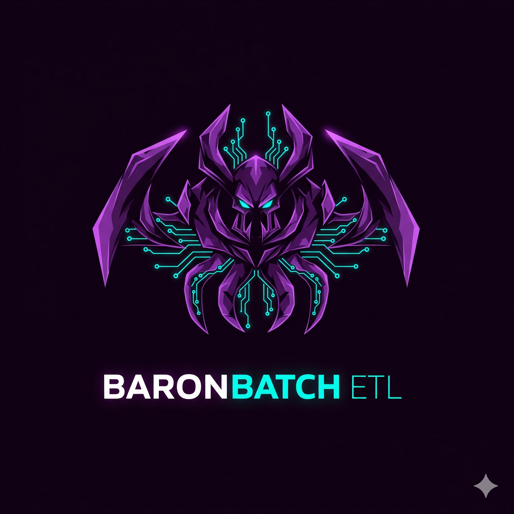
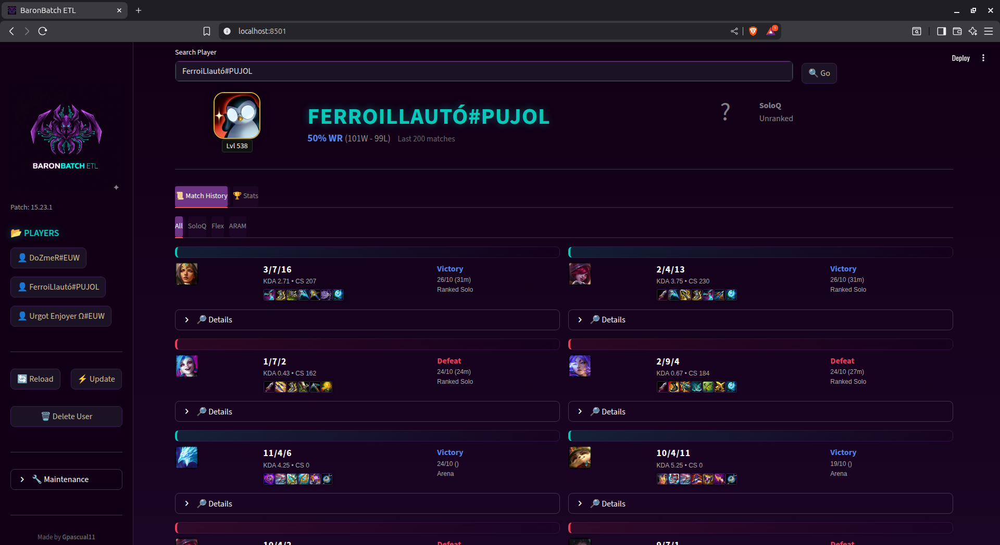

## 👾 BaronBatch ETL - Distributed LoL Analytics

<div align="center">

</div>

> **A fully automated, distributed League of Legends data analysis system based on Microservices.**

This project implements a professional **ETL (Extract, Transform, Load)** architecture designed to bypass API rate limits and process massive amounts of match data in real-time using parallel worker nodes.

<div align="center">

</div>

## System Architecture

The system is orchestrated using **Docker Compose** and consists of **6 interacting services**:

| Service | Tech Stack | Type | Description |
| :--- | :--- | :--- | :--- |
| **`dashboard`** | Streamlit | **Frontend** | Interactive UI for searching players, visualizing winrates, and triggering updates. |
| **`api_service`** | FastAPI | **Orchestrator** | Manages user data, splits jobs into small batches, and pushes tasks to Redis. |
| **`redis`** | Redis | **Message Queue** | Acts as the buffer between the API and Extractors. Holds the "Task List". |
| **`extractor`** | Python | **Worker (x2)** | **Extract (E).** Independent workers that pull tasks from Redis and download data from Riot using unique API keys. |
| **`transformer`** | Python | **Processor** | **Transform (T).** Cleans raw JSONs, normalizes IDs (Key Mismatch fix), and calculates stats. |
| **`db`** | MongoDB | **Storage** | Stores raw JSON (for data lakes) and structured clean data (for analytics). |

### Data Flow ( The Pipeline )

1.  **Trigger:** User adds for example `Agurin#DND` via the Dashboard.
2.  **Orchestration:** `api_service` validates the user and **splits the match history** (e.g., 200 games) into smaller tasks of **50 matches**.
3.  **Queueing:** These tasks are pushed to the `extraction_queue` in **Redis**.
4.  **Distributed Extraction:**
      * **Extractor 1** (Key A) and **Extractor 2** (Key B) race to pick up tasks.
      * If one key hits a Rate Limit (429), that worker sleeps while the other keeps working.
      * **Smart Resolution:** If a worker picks up a task encrypted for a different key, it auto-translates the ID locally.
5.  **Transformation:** The `transformer_loader` detects new raw data, cleans it (removing unused fields), and saves it to `matches_clean`.
6.  **Visualization:** The Dashboard pulls the aggregated stats from the DB via the API.

-----

## Getting Started

### Prerequisites

  * **Docker Desktop** installed.
  * **1 or 2 Riot API Keys** (Get them at [developer.riotgames.com](https://developer.riotgames.com)).

### 1\. Configuration

Create a `.env` file in the root directory. You can use two different keys to double your speed, or the same key twice if you only have one.

```bash
# .env file
RIOT_API_KEY_1=RGAPI-xxxxxxxx-xxxx-xxxx-xxxx-xxxxxxxxxxxx
RIOT_API_KEY_2=RGAPI-yyyyyyyy-yyyy-yyyy-yyyy-yyyyyyyyyyyy
```

### 2\. Launch

Run the entire stack in the background:

```bash
docker-compose up -d --build
```

### 3\. Usage

Access the dashboard at:
👉 **[http://localhost:8501](https://www.google.com/search?q=http://localhost:8501)**

-----

## Command Cheat Sheet

### Service Management

| Goal | Command |
| :--- | :--- |
| **View Backend Logs** | `docker logs -f api_service` |
| **View Extractor Activity** | `docker logs -f extractor_1` (or `extractor_2`) |
| **Restart a Service** | `docker-compose restart transformer_loader` |
| **Stop Everything** | `docker-compose down` |

### Manual Triggers (API)

You can manually trigger jobs using `curl` or your browser:

  * **Refresh All Users:** `http://localhost:8003/refresh`
  * **Trigger Extraction (50 games):** `http://localhost:8001/trigger_extract?count=50`

### Database (MongoDB)

Access the database shell inside Docker:

```bash
docker exec -it db mongosh riot
```

Useful commands:

```javascript
db.matches_raw.countDocuments()   // See how many raw JSONs you have
db.matches_clean.countDocuments() // See how many processed games you have
db.summoners.find().pretty()      // List all tracked users
```

-----

## Key Features

### Rate Limit "Anti-Blocking"

Riot limits Dev keys to 100 requests every 2 minutes.

  * **The Problem:** Downloading 200 matches takes \~201 requests.
  * **Our Solution:** The `api_service` splits the job into 4 batches of 50. The extractors process a batch, sleep if needed, and let the other extractor handle the rest.

### Key Mismatch Resolution

Riot encrypts PUUIDs differently for every API Key application.

  * **The Issue:** User added with Key A cannot be read by Extractor using Key B.
  * **Our Fix:** The Extractors detect `400 Bad Request` decryption errors and automatically call `Account-V1` to get a "local" PUUID valid for their specific key, ensuring seamless multi-key processing.

### Auto-Region Discovery

You don't need to select a region. The system analyzes the tag line:

  * `#KR1` -\> routes to **Korea**
  * `#NA1` -\> routes to **North America**
  * `#EUW` -\> routes to **Europe**

-----

## Project Structure

```
riot_etl_project/
├── docker-compose.yml       # Orchestrates the 5 containers + DB + Redis
├── .env                     # API Keys (Not in repo)
├── api_service/             # [FastAPI] The Brain. Talks to DB & Redis.
│   ├── main.py
│   └── Dockerfile
├── extractor/               # [Python] The Muscle. Downloads data.
│   ├── main.py              # Contains Rate Limit & Key logic
│   └── Dockerfile
├── transformer_loader/      # [Python] The Logic. Cleans data.
│   ├── main.py              # Stats calculation (KDA, CS/min)
│   └── Dockerfile
└── dashboard/               # [Streamlit] The Face.
    ├── assets/
    │   ├── logo.png
    │   └── logo_small.png
    ├── app.py
    └── Dockerfile
```

-----

*Built with ❤️, Python, and Microservices.*
